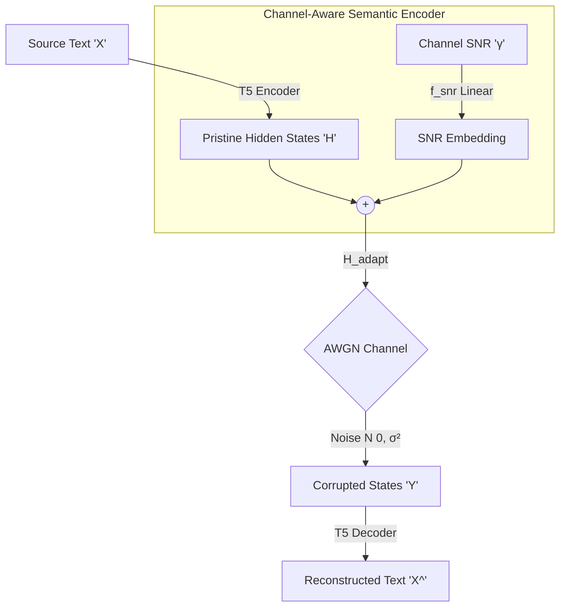

<div align="center">
  
# 🌐 Deep Generative Semantic Communication
**A Geometric Approach to Channel-Aware Language Models & Agentic Protocols**

[](https://www.python.org/downloads/)
[](https://pytorch.org/)
[](https://huggingface.co/)
[](https://opensource.org/licenses/MIT)

</div>

---

## Abstract

Traditional communication systems (Shannon Paradigm) blindly transmit bits regardless of their meaning. **Deep Generative Semantic Communication** shifts this paradigm by extracting the underlying semantic intent of a message and transmitting it directly through a continuous latent space.

This project explores the architectural evolution from rigid LSTM-based Joint Source-Channel Coding (JSCC) to highly dynamic, **Channel-Aware Generative Transformers (T5)**. By injecting physical channel states (SNR) directly into the semantic manifold, we force the language model to develop _Latent Semantic Diversity_—dynamically restructuring its geometric representation to survive severe Additive White Gaussian Noise (AWGN).

---

## The Mathematics

Instead of transmitting a discrete sequence of bits, the source text $X$ is encoded into a continuous semantic matrix $H \in \mathbb{R}^{T \times d}$.

To shield this information from the channel, the **Adaptive SNR-Embedding** ($f_{snr}$) mathematically translates the manifold based on the physical channel condition $\gamma$ (Signal-to-Noise Ratio):

$$H_{adapt} = H_{pristine} + f_{snr}(\gamma)$$

The signal is then transmitted through the physical AWGN channel:

$$Y = H_{adapt} + \mathcal{N}\left(0, \frac{P_{signal}}{10^{\gamma/10}}\right)$$

The receiver's Generative Decoder directly reconstructs the semantic intent $\hat{X}$ from the corrupted geometry $Y$.

---

##Project Phases

This repository is structured into a 5-Phase evolutionary curriculum. **Phases 1 and 2 are fully implemented in Release 1.** Phases 3, 4, and 5 belong to the upcoming Release 2.

### 🔹 Phase 1: The JSCC Baseline

- **Architecture:** LSTM-based Semantic Autoencoder.
- **Objective:** Establish the baseline for mapping English text (Europarl dataset) into a continuous vector space and reconstructing it post-channel.
- **Finding:** Standard recurrent models produce "thin" semantic manifolds that collapse catastrophically under escalating variance $\sigma^2$.

### 🔹 Phase 2: The Generative Leap & Channel Adaptation

- **Architecture:** Transformer (T5-Small) with Dynamic `snr_embed` Neural Layer.
- **Objective:** Enable the Generative LLM to "breathe" with the environment by altering its internal logic based on the channel SNR.
- **Geometric Probing Suite:** We utilized advanced representation learning metrics to mathematically prove the model's behavior:
  - **Effective Rank ($r_{eff}$):** By computing the entropy of the singular value spectrum ($r_{eff} = \exp(-\sum p_i \ln p_i)$), we proved that the adaptive model expands its intrinsic dimensionality ($356 \rightarrow 391$) to combat noise.
  - **Centered Kernel Alignment (CKA):** $CKA(X,Y) = \frac{tr(K_X K_Y)}{\sqrt{tr(K_X K_X)tr(K_Y K_Y)}}$. Layerwise heatmaps confirmed the adaptive model explicitly deforms its deep representation geometry when SNR drops.
  - **Information Bottleneck (PCA):** By compressing the manifold to $k$ dimensions, we discovered the adaptive model is heavily compression-resistant ($L(k) = \frac{1}{Nd} \sum_{i=k+1}^{d} \sigma_i^2$), confirming it achieves **Latent Semantic Diversity** by spreading information across orthogonal axes.

### Phase 3: The Safety Net

- **Focus:** NLP Verification & Hallucination Pruning.
- **Objective:** Generative decoders hallucinate fluent but incorrect sentences under heavy noise. Phase 3 introduces deterministic semantic stores and NLP verification logic to detect, flag, and prune these hallucinations before they reach the end-user.

### Phase 4: The Agentic Protocol _(WIP)_

- **Focus:** Multi-Agent Communication.
- **Objective:** Transition from passive text transmission to active negotiation. Two autonomous LLM agents will utilize the noisy semantic channel to communicate, debate, and achieve goal-oriented tasks, requesting re-transmissions only when semantic intent is lost.

### 🔸 Phase 5: The Final Synthesis _(WIP)_

- **Focus:** Full System Integration.
- **Objective:** Unify Channel-Aware Transformers, Hallucination Safety Nets, and Agentic Protocols into a single, fully autonomous Semantic Network.

---

## 🧠 System Architecture (Phase 2)



---

---

## 🛠️ Getting Started

### 1. Train the Adaptive Model

To break the initial random symmetry and organize the semantic geometry, run the rapid prototyping curriculum (15 mins):

```bash
python src/llm_mini_train_2.py
```

_Note: For maximum BLEU score, run `src/llm_train_2.py` overnight._

### 2. Run the Geometric Probing Suite

Open your Jupyter environment and execute the analysis notebooks sequentially to witness the manifold physics in real-time:

1. **`effectiverank.ipynb`**: Watch the singular value spectrum flatten and intrinsic dimensionality expand.
2. **`information_bottleneck.ipynb`**: Observe the PCA reconstruction loss skyrocket, proving Latent Semantic Diversity.
3. **`cka_analysis.ipynb`**: See the representation geometry deform in real-time as channel conditions worsen.

---

<div align="center">
  <i>Stay tuned for Release 2 where we introduce Deterministic Safety Nets and Multi-Agent Protocols!</i>
</div>
